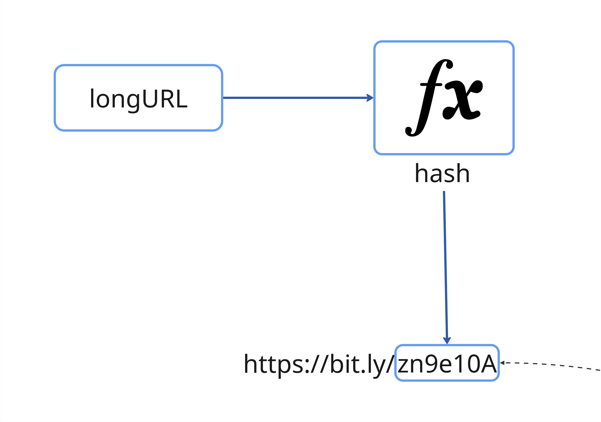
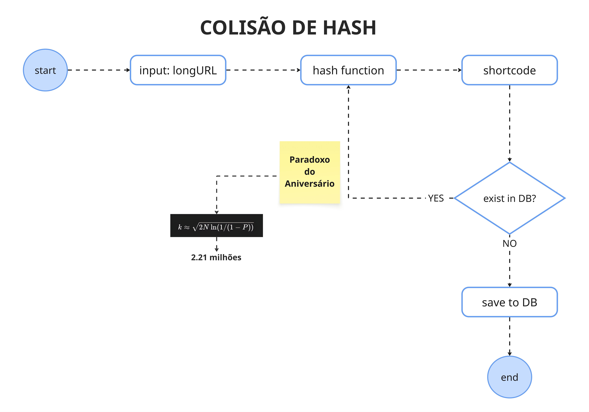
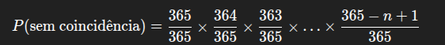
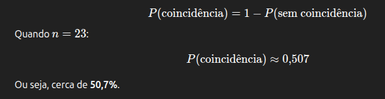
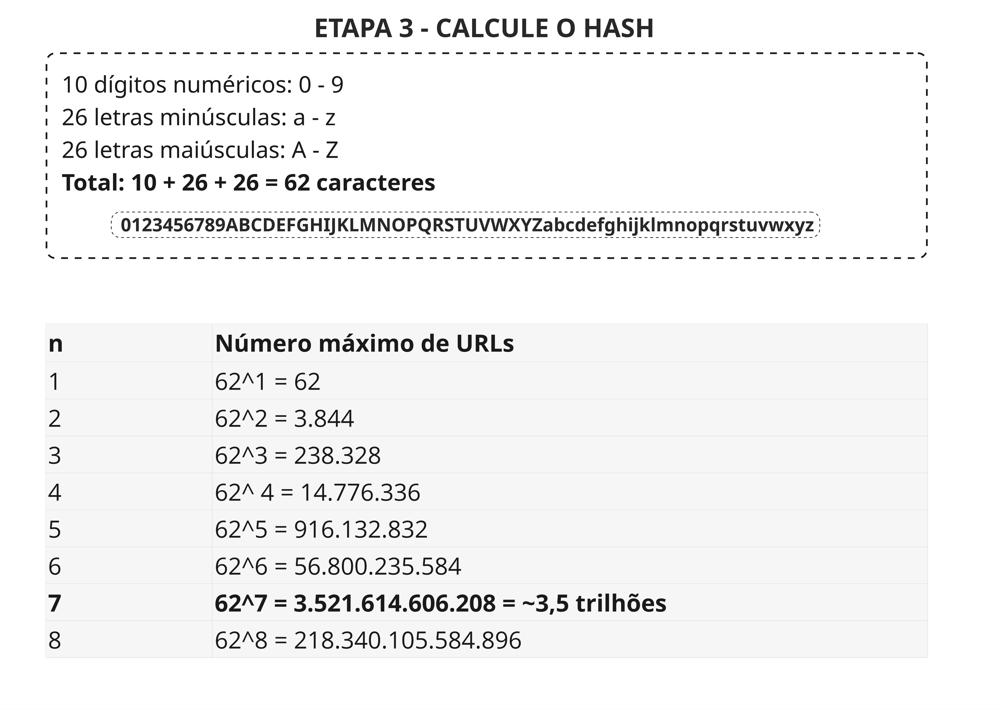
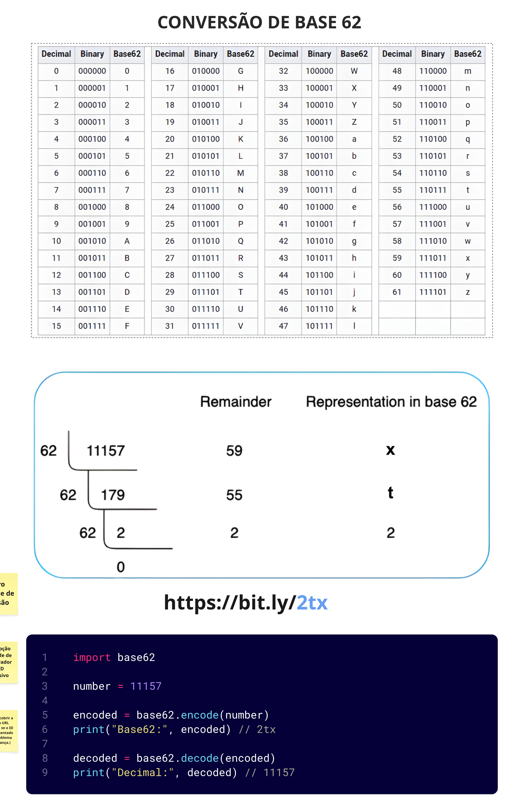

# Arquitetura do Projeto

Dividida em camadas bem definidas para separar responsabilidades (exemplo com typescript):

```bash
src/
├── domain/             # Regras de negócio (Entidades, Interfaces, Use Cases)
├── application/        # Casos de uso (Application Services)
├── infrastructure/     # Comunicação externa (DB, Redis, Logger)
├── presentation/       # Controllers, rotas e validações
├── shared/             # Helpers, erros, configurações comuns
└── main.ts             # Ponto de entrada
```

# Destaques da Estrutura

- `docs/architecture/` → guarda todos os diagramas (C4, UML, DDD) e os ADRs.
- `docs/engineering/` → foca na engenharia de software: APIs, dados, testes, observabilidade.
- `docs/infrastructure/` → mistura documentação + código (IaC) para garantir rastreabilidade.
- `docs/security/` → concentra políticas de segurança e compliance.
- `ADRs numerados (0001-xxx.md)` → ajudam a manter histórico das decisões arquiteturais.

# Padrão de Commits

Esse projeto utiliza o "[Conventional Commits](https://www.conventionalcommits.org/en/v1.0.0/)".
Utilize sempre o "[Conventional Commits](https://www.conventionalcommits.org/en/v1.0.0/)" em cada alteração do projeto!

# Fluxo de Funcionamento

1. Usuário envia uma URL longa via POST /shorten.
2. O sistema gera um hash único e armazena a correspondência no banco de dados.
3. O sistema retorna a URL encurtada (https://short.ly/abc123).
4. Quando alguém acessa /abc123, o sistema redireciona para a URL original.

# Requisitos Técnicos

> **Linguagem**: TypeScript (Node.js) ou PHP

> **Framework**: Nest.js (com TypeScript) ou Laravel/Symfony

> **Banco de Dados**: PostgreSQL ou MongoDB

> **Cache**: Redis (para redirecionamento rápido)

> **Outros**: Docker, Swagger/OpenAPI, ESLint/Prettier, PHPUnit

# Design de Classes e Responsabilidades (Princípios SOLID)

## S - Single Responsibility Principle

Cada classe tem uma responsabilidade única:

- `UrlShortenerService` → lógica de encurtamento
- `UrlRepository` → acesso ao banco
- `RedirectController` → apenas para redirecionar

## O - Open/Closed Principle

A lógica de geração de hash pode ser trocada sem alterar o serviço:

```ts
interface HashGenerator {
  generate(url: string): string;
}
```

## L - Liskov Substitution Principle

Qualquer implementação de `HashGenerator` deve poder ser usada no lugar de outra sem quebrar o sistema.

## I - Interface Segregation Principle

Evita interfaces muito grandes, dividindo responsabilidades:

```ts
interface UrlReader {
  findByHash(hash: string): Url | null;
}

interface UrlWriter {
  save(url: Url): void;
}
```

## D - Dependency Inversion Principle

As dependências (como repositórios) são injetadas por abstrações:

```ts
class UrlShortenerService {
  constructor(private readonly repo: UrlRepository) {}
}
```

# Segurança

- Validação de URLs maliciosas
- Limitação de taxa (`rate limiting`)
- Códigos curtos com tempo de expiração (opcional)
- Sanitização de entradas

# Possíveis Extensões Futuras

- Dashboard com visualização das URLs encurtadas
- Autenticação para usuários criarem e gerenciarem suas URLs
- Personalização de aliases (`/meu-link`)
- QR Code automático

# Requisitos funcionais e não funcionais

Os [requisitos funcionais e não funcionais](./docs/engineering/REQUIREMENTS.md) podem ser detalhados [aqui](./docs/engineering/REQUIREMENTS.md).

# Calculo das Estimativas

Operações de gravação: 100 milhões de URLs por dia = **100.000.000 / 24 / 60 / 60 = 1160 RPS**

Operações de leitura: **10:1 = 1160 * 10 = 11.600 RPS** (RPS: Requisições por segundo)

Tempo de armazenamento das URLs: 10 anos = **100.000.000 * 365 * 10 = 365 Bilhões de registros**

Capacidade de armazenamento: 100 bytes por URL = **365 Bilhões * 100 bytes = 36,5Tb**

# Banco de Dados

O **banco de dados** escolhido para essa aplicação foi o [Cassandra Query Language](https://cassandra.apache.org/doc/4.0/cassandra/cql/).

Para mais informações sobre a implementação do [Cassandra Query Language](./docs/infrastructure/DATABASE.md) acesse [aqui](./docs/infrastructure/DATABASE.md).

# Gerando a HASH

Através de uma **URL longa**, vamos criar uma **URL curta** através da função de **HASH**:



Qual é a forma que será utilizada para gerar o nosso **hash**?

Não podemos utilizar o **md5** para a construção das hashes, por conta do **paradoxo de aniversário**.



O **paradoxo do aniversário** (ou birthday paradox) é um famoso problema de probabilidade que mostra como nossa intuição costuma falhar quando pensamos em eventos aleatórios.

## A ideia básica

A pergunta é:

"Quantas pessoas são necessárias em uma sala para que a probabilidade de duas delas fazerem aniversário no mesmo dia seja maior que 50%?"

A resposta surpreendente é: apenas 23 pessoas.

## Por que isso é um paradoxo?

Porque intuitivamente, muita gente pensa que seria necessário um número muito maior — algo perto de 183 pessoas (metade de 365 dias).
Mas a matemática mostra que a coincidência acontece muito antes disso.

## O raciocínio matemático

Vamos supor:

365 dias possíveis de aniversário (ignorando anos bissextos);

todos os aniversários são igualmente prováveis.

1. A probabilidade de duas pessoas não **compartilharem o mesmo aniversário é**: 1/365

2. A probabilidade de todas as pessoas em um grupo de `n` terem **aniversários diferentes** é:



3. A probabilidade de **pelo menos duas pessoas** compartilharem o mesmo aniversário é o complemento disso:



## Calculando o HASH

Para esse projeto será usado o cálculo `base 62`, com base no cálculo abaixo:



Como vamos utilizar até **7 caracteres** na composição da URL encurtada, isso resulta em **~3.5 trilhões** de combinações.

### Solução

A conversão de **base 62** é a nossa solução para o **problema de colisão**:



