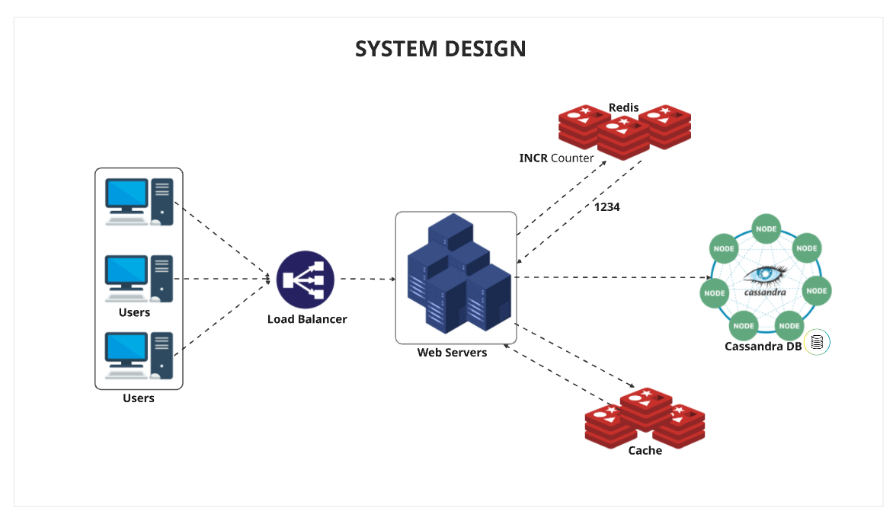

# Design de Sistemas (arquitetura)

O design de sistemas (ou arquitetura) é o processo de planejar e definir a estrutura de um sistema de software, detalhando seus componentes, módulos, interfaces e interações para atender a requisitos funcionais e não-funcionais. 

O objetivo é criar uma arquitetura organizada, eficiente e escalável, que guie o desenvolvimento e facilite a manutenção e o desempenho do sistema. É um conceito amplo, distinto do design system (sistema de design), que foca em componentes visuais e reutilizáveis para a identidade de um produto. 

## O que envolve o design de sistemas

- **Decomposição do sistema**: Dividir o sistema em partes menores (serviços, componentes e módulos) para torná-lo mais gerenciável.
- **Definição de componentes e interfaces**: Especificar quais componentes serão necessários e como eles se comunicarão entre si e com o mundo externo.
- **Planejamento de dados**: Definir como os dados serão armazenados, processados e como as diferentes partes do sistema acessarão esses dados.
- **Adoção de padrões**: Utilizar padrões arquiteturais (como microserviços, arquitetura orientada a eventos, etc.) para resolver problemas comuns e estruturar o sistema de forma eficiente.
- **Consideração de requisitos não-funcionais**: Garantir que o sistema seja escalável, confiável, tolerante a falhas e com bom desempenho, levando em conta os trade-offs de cada decisão.
- **Criação de um plano**: Produzir um plano detalhado que sirva como guia para a equipe de desenvolvimento durante a implementação.

## Descrição do Sistema

Quando uma grande quantidade de requisições for realizada para o nossos sistema, o Load Balance vai dividir entre os servidores horizontalmente.

Após essa divisão, o sistema vai utilizar o mecanismo `INCR Counter` do [REDIS](https://redis.io/) em `cluster` para gerar os números que serão utilizados na geração das URLs encurtadas.

Para persistir os dados de maneira agil e eficiente o [Casandra DB](https://cassandra.apache.org/_/index.html) será utilizado, pois conforme a necessidade novos `nós` serão criados conforme o volume dos dados for crescendo.

E mais uma instância do [REDIS](https://redis.io/) será criada, para salvar as URLs que são mais visitadas, **diminuindo o volume de acesso ao banco de dados** e trazendo **mais velocidade na resposta** das requisições.

**Para mais detalhes veja a imagem abaixo**:

