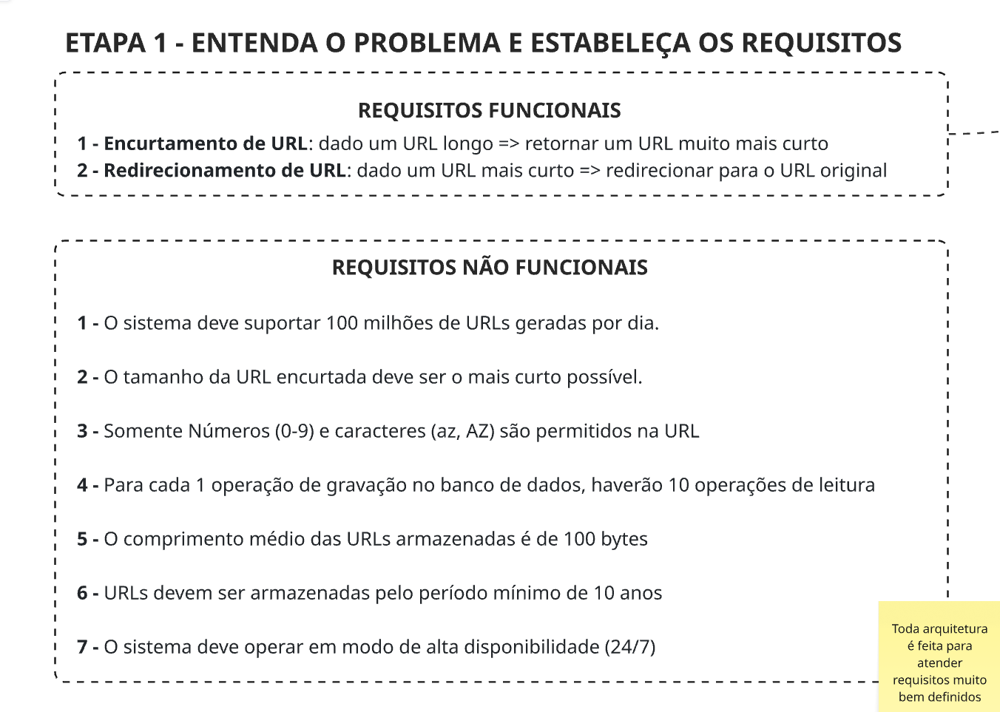

# Requisitos funcionais e não funcionais

Os **requisitos funcionais** descrevem o que um software deve fazer (as funções e tarefas) e são definidos pelas necessidades do usuário.

Os **requisitos não funcionais** especificam como o software deve realizar essas funções, focando em aspectos de qualidade como desempenho, segurança e usabilidade.

## Requisitos Funcionais

1. Encurtamento de URL: dado uma URL longo, quero retornar uma URL muito mais curto;
2. Redirecionamento de URL: dado uma URL mais curta, quero redirecionar para a URL original;

## Requisitos Não Funcionais

1. O sistema deve suportar 100 milhões de URLs geradas por dia;
2. O tamanho da URL encurtada deve ser o mais curto possível;
3. Somente Número (0-9) e caracteres (az, AZ) são permitidos na URL;
4. Para cada 1 operação de gravação no banco de dados, haverão 10 operações de leitura;
5. O comprimento médio das URLs armazenadas é de 100 bytes;
6. URLs devem ser armazenadas pelo período mínimo de 10 anos;
7. O sistema deve operar em modo de alta disponibilidade (24/7);
