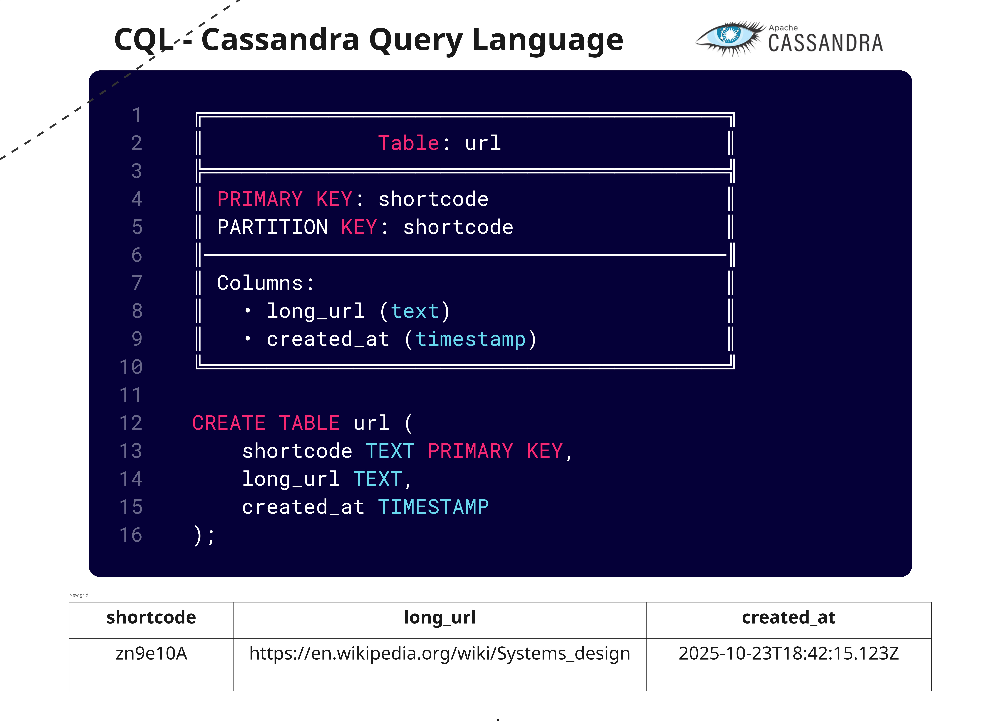

# Banco de Dados

O **banco de dados** escolhido para essa aplicação foi o [Cassandra Query Language](https://cassandra.apache.org/doc/4.0/cassandra/cql/).

## Razões para utilizar o CQL

O **Cassandra Query Language** (CQL) é a linguagem principal para interagir com o **Apache Cassandra** e deve ser utilizada porque oferece uma interface semelhante ao SQL, mas otimizada para a arquitetura distribuída e escalável do Cassandra. Ele simplifica o gerenciamento de dados NoSQL, abstraindo a complexidade de como os dados são armazenados e distribuídos em um cluster. 

**Principais Razões para Utilizar CQL**:

1. **Facilidade de Aprendizagem**: A sintaxe do CQL é muito similar ao SQL tradicional, o que facilita a curva de aprendizado para desenvolvedores já familiarizados com bancos de dados relacionais.
2. **Otimização de Performance e Escalabilidade**: O CQL foi projetado para funcionar perfeitamente com a arquitetura ponto a ponto e de escalabilidade horizontal do Cassandra. As consultas são otimizadas para alto desempenho de leitura e escrita, essenciais para aplicações de Big Data.
3. **Modelo de Dados Flexível**: O CQL permite um modelo de dados dinâmico e flexível, que suporta tipos de dados modernos como coleções (listas, mapas, conjuntos). Isso simplifica o gerenciamento de esquemas, permitindo a adição de novas colunas sem downtime significativo, o que é um grande contraste com os bancos de dados SQL tradicionais.
4. **Foco na Disponibilidade e Tolerância a Falhas**: A modelagem de dados no Cassandra, orientada pelo CQL, considera a replicação de dados em vários nós e centros de dados, garantindo alta disponibilidade e tolerância a falhas sem um ponto único de falha.
5. **Projetado para Consultas Específicas**: No Cassandra, a modelagem de dados é centrada nas consultas que serão executadas. O CQL força o desenvolvedor a modelar tabelas para consultas específicas, o que, embora diferente da normalização do SQL, resulta em consultas muito rápidas e previsíveis em grandes volumes de dados. 

---

---
